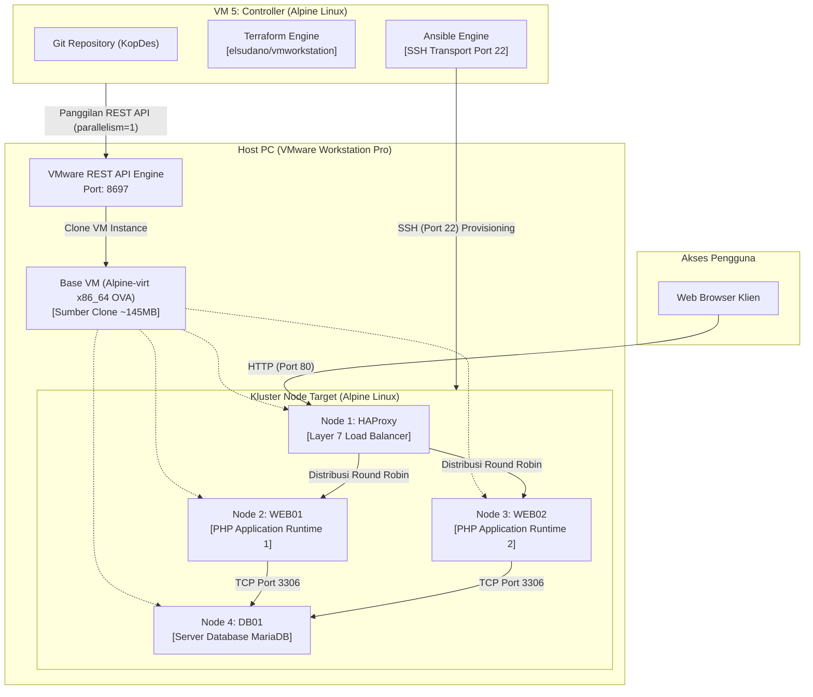

# KopDes Merah Putih: Otomasi Infrastruktur dan Platform Koperasi Desa

Implementasi Infrastructure as Code (IaC) dan manajemen konfigurasi multi-tier untuk Platform Koperasi Desa KopDes Merah Putih, diotomatisasi menggunakan Terraform, Ansible, dan VMware Workstation berbasis template Alpine Linux yang sangat ringan (ultralightweight).

---

## Daftar Isi

- [Ringkasan Proyek](#ringkasan-proyek)
- [Arsitektur Sistem](#arsitektur-sistem)
- [Topologi Infrastruktur](#topologi-infrastruktur)
- [Pemisahan Tanggung Jawab](#pemisahan-tanggung-jawab)
- [Teknologi yang Digunakan](#teknologi-yang-digunakan)
- [Manajemen Layanan dan Runtime (OpenRC)](#manajemen-layanan-dan-runtime-openrc)
- [Role Pengguna dan Hak Akses](#role-pengguna-dan-hak-akses)
- [Struktur Direktori Repository](#struktur-direktori-repository)
- [Panduan Deployment](#panduan-deployment)
- [Lisensi dan Catatan](#lisensi-dan-catatan)

---

## Ringkasan Proyek

KopDes Merah Putih adalah platform digital yang dirancang untuk mengelola unit usaha koperasi desa, rantai pasok komoditas lokal, registrasi keanggotaan warga, serta pencatatan transaksi kasir Point of Sale (POS).

Repository ini menyediakan lapisan otomasi infrastruktur lengkap untuk melakukan provisioning, konfigurasi, dan orkestrasi platform pada cluster multi-node dengan ketersediaan tinggi (High Availability). Proyek ini memanfaatkan template **Alpine Linux (Alpine-virt x86_64, ~145 MB)** yang sangat hemat memori (hanya membutuhkan 256MB - 512MB RAM per VM) dan memiliki waktu booting instan.

Otomasi memanfaatkan HashiCorp Terraform untuk mengelola siklus hidup cloning Virtual Machine melalui VMware Workstation REST API, serta Ansible untuk menjalankan manajemen konfigurasi yang idempotent, penyediaan runtime, dan deployment kode aplikasi melalui protokol SSH standar.

---

## Arsitektur Sistem

Arsitektur sistem menerapkan kluster produksi empat node yang berada di belakang load balancer Layer 7. Load balancer mendistribusikan beban lalu lintas secara merata ke dua server aplikasi PHP yang terhubung ke server database MariaDB terpusat.



---

## Topologi Infrastruktur

Sistem menggunakan total **6 Virtual Machine berbasis Alpine Linux** di VMware Workstation yang semuanya berasal dari template OVA yang sama (`Alpine-virt-3.24.1-x86_64`):

| No | Hostname | Peran (Role) | Status VM | IP Default | RAM | Layanan Utama |
| :--- | :--- | :--- | :--- | :--- | :--- | :--- |
| 1 | `KopDes-Controller` | Workstation Otomasi | Aktif | `192.168.X.20` / DHCP | 512 MB | Git, Terraform, Ansible Core, OpenSSH |
| 2 | `Alpine-Base-VM` | Template Master Clone | Powered Off | - | 512 MB | Golden Image sumber cloning Terraform |
| 3 | `KopDes-HAProxy` | Load Balancer | Aktif | `192.168.X.10` | 512 MB | HAProxy (Port 80), Dashboard Stats (8404) |
| 4 | `KopDes-Web01` | Server Aplikasi 1 | Aktif | `192.168.X.11` | 512 MB | PHP CLI Service (Port 80) via OpenRC |
| 5 | `KopDes-Web02` | Server Aplikasi 2 | Aktif | `192.168.X.12` | 512 MB | PHP CLI Service (Port 80) via OpenRC |
| 6 | `KopDes-DB01` | Database Server | Aktif | `192.168.X.13` | 512 MB | MariaDB 10.x Server (Port 3306) |

*Catatan: Total 6 VM hanya membutuhkan alokasi memori gabungan sekitar 3 GB RAM pada Host PC. IP `192.168.X.2` dicadangkan secara default oleh gateway NAT VMware Workstation (`vmnet8`), sehingga Controller menggunakan DHCP atau IP statis `192.168.X.20`.*

---

## Pemisahan Tanggung Jawab

Setiap komponen dalam repository memiliki batasan fungsi yang jelas:

| Lapisan | Tanggung Jawab Utama | Batasan |
| :--- | :--- | :--- |
| **Terraform** | Mengelola siklus hidup Virtual Machine: cloning dari template base Alpine Linux, alokasi vCPU, memori RAM, konfigurasi adapter jaringan, dan pembuatan disk virtual. | Tidak menginstal paket software, tidak mengonfigurasi database, dan tidak menginjeksi environment runtime. |
| **Ansible** | Orkestrasi pasca-booting: instalasi paket via `apk`, inisialisasi database MariaDB, deployment source code ke `/var/www/kopdes`, registrasi OpenRC service, dan injeksi `.env`. | Tidak bertanggung jawab atas pembuatan atau penghapusan VM pada level hypervisor. |
| **Aplikasi Web** | Menjalankan logika bisnis platform koperasi: autentikasi, manajemen katalog, transaksi kasir, dan penentuan koordinat lokasi unit usaha. | Source code aplikasi terisolasi dari perkakas deployment dan hypervisor. |
| **Base Virtual Machine** | Template gold image Alpine Linux (~145 MB) dengan OpenSSH aktif dan kredensial standar `alpine:alpine`. | Hanya berfungsi sebagai sumber cloning (read-only) dan tidak melayani traffic aplikasi secara langsung. |

---

## Teknologi yang Digunakan

### Infrastruktur dan Otomasi
- **Hypervisor**: VMware Workstation Pro 25H2
- **Antarmuka Hypervisor**: VMware REST API (`vmrest.exe`)
- **Sistem Operasi Tamu**: Alpine Linux (Alpine-virt x86_64)
- **Infrastructure as Code**: Terraform v1.5+ dengan provider `elsudano/vmworkstation` v1.0.4
- **Configuration Management**: Ansible Core 2.15+
- **Protokol Transport**: Secure Shell (SSH Port 22)

### Platform dan Runtime Aplikasi
- **Load Balancer**: HAProxy (Layer 7 Round Robin, Health Checks aktif)
- **Runtime Aplikasi**: PHP 8.x (Alpine APK Package)
- **Manajer Layanan**: OpenRC (`openrc-run`, `rc-service`, `rc-update`)
- **Database Engine**: MariaDB 10.x (Alpine APK Package)
- **Frontend Aplikasi**: Plain HTML5, Modern Vanilla CSS3, JavaScript Modular, Leaflet.js

---

## Manajemen Layanan dan Runtime (OpenRC)

Alpine Linux menggunakan **OpenRC** sebagai sistem inisialisasi dan manajemen layanan bawaan yang sangat ringan:
- `kopdes`: Skrip layanan OpenRC (`/etc/init.d/kopdes`) membungkus web server PHP dengan logging terpusat ke `/var/log/kopdes/` dan restart otomatis.
- `haproxy`: Dikelola secara native melalui `rc-service haproxy` dengan health check aktif ke backend web.
- `mariadb`: Dikelola melalui `rc-service mariadb` dengan isolasi izin akses jaringan per subnet.

### Idempotensi Playbook Ansible
- **Penyediaan Database**: Role MariaDB melakukan pengecekan direktori `/var/lib/mysql/mysql` dan keberadaan tabel sebelum migrasi SQL, memastikan data tidak tertimpa saat playbook dijalankan berulang kali.
- **Penyediaan Paket**: Seluruh task memanfaatkan manajer paket native `apk` yang otomatis melewatkan instalasi jika dependensi sudah terpasang.

---

## Role Pengguna dan Hak Akses

Platform KopDes menyediakan sistem kontrol akses berbasis peran (RBAC) dengan kredensial default sebagai berikut:

| Identifier Role | Username Default | Password Default | Lingkup Otoritas |
| :--- | :--- | :--- | :--- |
| `HEAD_GOV` | `head@gov.local` | `password123` | Administrator wilayah: membuat unit koperasi baru (+ Spawn KopDes), audit omzet kumulatif, penambahan akun manager (+ Tambah Akun Manager), penugasan unit KopDes, dan pemantauan kluster. |
| `MANAGER` | `manager@gov.local` s.d. `manager15@gov.local` | `password123` | Pengelola unit usaha: manajemen etalase komoditas, registrasi anggota warga desa, dan pencatatan transaksi kasir (Tersedia 15 akun default untuk 15 unit KopDes awal). |
| `CITIZEN` | `citizen@gov.local` (atau daftar mandiri) | `password123` | Warga desa: akses katalog komoditas koperasi, pendaftaran akun mandiri via menu Register, pengajuan keanggotaan, pemesanan produk desa, dan nota transaksi. |

---

## Struktur Direktori Repository

```text
kopdes/
|-- terraform/                         # Infrastructure as Code (Provisioning VM)
|   |-- versions.tf                    # Deklarasi provider elsudano/vmworkstation
|   |-- variables.tf                   # Definisi variabel (Subnet ID, Host, VM IDs, RAM)
|   |-- terraform.tfvars               # Nilai variabel deployment lingkungan
|   |-- main.tf                        # Deklarasi resource untuk 4 VM target
|   `-- outputs.tf                     # Output alokasi IP dan topologi kluster
|
|-- ansible/                           # Manajemen Konfigurasi dan Deployment
|   |-- ansible.cfg                    # Konfigurasi SSH, timeout, dan transport
|   |-- inventory.ini                  # Definisi inventory host target Alpine Linux
|   |-- group_vars/
|   |   `-- all.yml                    # Variabel global, path direktori, kredensial
|   |-- site.yml                       # Master playbook multi-play
|   `-- roles/
|       |-- common/                    # Baseline paket Alpine (python3, curl, openrc)
|       |-- database/                  # Instalasi MariaDB, inisialisasi datadir, import data
|       |-- webserver/                 # Runtime PHP, layanan OpenRC, deploy kode, .env dinamis
|       `-- haproxy/                   # Paket HAProxy, konfigurasi Round Robin, health check
|
|-- config/                            # Konfigurasi database dan environment aplikasi
|-- database/                          # Skema SQL produksi dan data seed awal
|-- includes/                          # Library dan komponen aplikasi PHP
|-- pages/                             # Tampilan halaman berbasis role dan endpoint API
|-- public/                            # Dokumen root web publik, styling CSS, dan aset
|-- tests/                             # Pengujian end-to-end dan integrasi otomatis
|-- .env.example                       # Template konfigurasi environment
|-- TUTORIAL.md                        # Panduan deployment lengkap langkah-demi-langkah
`-- README.md                          # Dokumentasi teknis dan arsitektur proyek
```

---

## Panduan Deployment

Panduan lengkap instalasi dan deployment dari awal (mulai dari persiapan template OVA Alpine Linux, aktivasi VMware REST API, provisioning Terraform, hingga deployment Ansible) tersedia pada dokumen tersendiri:

**[Panduan Lengkap Deployment dari Awal (TUTORIAL.md)](TUTORIAL.md)**

---

## Lisensi dan Catatan

Proyek ini merupakan model implementasi otomasi infrastruktur DevOps untuk tujuan simulasi dan pembelajaran teknis. Seluruh nama desa, data unit koperasi, dan riwayat transaksi pada seed awal merupakan data dummy untuk pengujian sistem.
