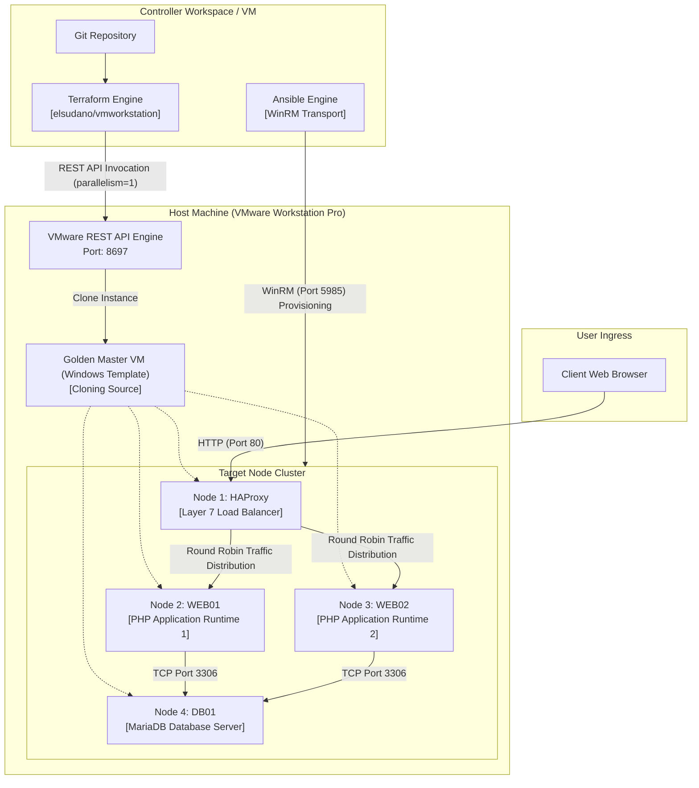

# KopDes Merah Putih: Infrastructure Automation and Platform

A multi-tier Infrastructure as Code (IaC) and configuration management implementation for the KopDes Merah Putih Village Cooperative Platform, automated using Terraform, Ansible, and VMware Workstation.

---

## Table of Contents

- [Overview](#overview)
- [System Architecture](#system-architecture)
- [Infrastructure Topology](#infrastructure-topology)
- [Separation of Concerns](#separation-of-concerns)
- [Technology Stack](#technology-stack)
- [Runtime and Service Management](#runtime-and-service-management)
- [Application Roles and Access](#application-roles-and-access)
- [Repository Structure](#repository-structure)
- [Deployment Guide](#deployment-guide)
- [License and Disclaimers](#license-and-disclaimers)

---

## Overview

KopDes Merah Putih is a full-featured digital platform designed to administer village cooperative business units, local commodity supply chains, member registers, and transactional point-of-sale activities. 

This repository provides the complete infrastructure automation layer required to provision, configure, and orchestrate the platform across a high-availability multi-node cluster. The automation stack utilizes HashiCorp Terraform to lifecycle virtual machine clones via the VMware Workstation REST API, and Ansible to execute idempotent configuration management, runtime provisioning, and application deployment over WinRM.

---

## System Architecture

The deployment architecture establishes an isolated four-node production cluster fronted by an L7 load balancer that distributes traffic evenly across redundant web application servers connected to a dedicated database node.



---

## Infrastructure Topology

The cluster spans four dedicated virtual machines connected over a private host-only virtual network switch.

| Hostname | Role | Operating System | Default IP | Target Services |
| :--- | :--- | :--- | :--- | :--- |
| `KopDes-HAProxy` | Load Balancer | Windows 64-bit | `192.168.X.10` | HAProxy (Port 80), Stats Dashboard (Port 8404) |
| `KopDes-Web01` | Application Server 1 | Windows 64-bit | `192.168.X.11` | PHP CLI Built-in Web Server (Port 8080) wrapped by NSSM |
| `KopDes-Web02` | Application Server 2 | Windows 64-bit | `192.168.X.12` | PHP CLI Built-in Web Server (Port 8080) wrapped by NSSM |
| `KopDes-DB01` | Central Database | Windows 64-bit | `192.168.X.13` | MariaDB 10.11 Server (Port 3306) |

*Note: The subnet octet `X` is parameterizable via centralized variables to support isolated multi-tenant and lab sandbox allocations.*

---

## Separation of Concerns

Each component within the repository adheres to strict functional boundaries:

| Layer | Responsibility | Constraints |
| :--- | :--- | :--- |
| **Terraform** | Virtual machine lifecycle management: cloning from base templates, setting CPU cores, allocating memory, configuring network adapters, and managing virtual disk instances. | Does not execute application configurations, install packages, or inject runtime configurations. |
| **Ansible** | Post-boot orchestration: Windows system baseline, firewall configuration, dependency retrieval, database initialization, service registration via NSSM, and dynamic `.env` configuration. | Does not provision or destroy hypervisor-level virtual machines. |
| **Web Application** | Core platform logic: business logic, session management, UI/UX, database queries, and geographical location pickers. | Application code remains decoupled from hypervisor and deployment tooling. |
| **Base Virtual Machine** | Golden image containing baseline Windows installation, VMware Tools, and enabled WinRM listeners. | Serves purely as a read-only template source and does not host production traffic. |

---

## Technology Stack

### Infrastructure and Automation
- **Hypervisor**: VMware Workstation Pro 25H2
- **Hypervisor Management**: VMware REST API (`vmrest.exe`)
- **Infrastructure as Code**: Terraform v1.5+ with `elsudano/vmworkstation` provider v1.0.4
- **Configuration Management**: Ansible Core 2.15+ with `ansible.windows` collection
- **Transport Layer**: Windows Remote Management (WinRM HTTP Port 5985)

### Platform and Runtimes
- **Load Balancer**: HAProxy 2.8+ for Windows (Layer 7 Round Robin, Active Health Checks)
- **Application Runtime**: PHP 8.2+ 64-bit Non-Thread Safe
- **Process Supervision**: Non-Sucking Service Manager (NSSM)
- **Database Engine**: MariaDB 10.11 Enterprise LTS
- **Application Frontend**: Plain Vanilla CSS3, Modern Modular JavaScript, Leaflet.js

---

## Runtime and Service Management

### Windows Service Management via NSSM
Ported binary utilities on Windows (such as native CLI builds of PHP and HAProxy) do not inherently integrate with the Windows Service Control Manager (`sc.exe`). Attempting to register them directly produces `Error 1053` (service failed to respond in a timely fashion). 

To ensure stability, Ansible orchestrates the **Non-Sucking Service Manager (`nssm.exe`)** to wrap each process:
- `KopDesWeb`: Wraps the PHP web server process on Web01 and Web02 with automatic restarts on crash and execution under background service privileges.
- `HAProxy`: Wraps the HAProxy load balancing process with background event logging and graceful reload capabilities.

### Idempotency and State Management
- **Database Provisioning**: The MariaDB role executes an initial verification check against existing database schemas before applying SQL migrations, preventing data overwrites during subsequent playbook runs.
- **Service Verification**: Ansible tasks use `win_service_info` and path guards to guarantee that packages and binaries are downloaded and installed only when absent.

---

## Application Roles and Access

The KopDes platform provides role-based access control out of the box with the following predefined test credentials:

| Role Identifier | Default Username | Default Password | Scope of Authority |
| :--- | :--- | :--- | :--- |
| `HEAD_GOV` | `head@gov.local` | `password123` | Executive regional administration, dynamic KopDes unit instantiation (Spawn KopDes), global revenue auditing, and cluster health monitoring. |
| `MANAGER` | `manager@gov.local` | `password123` | Cooperative branch operations: commodity inventory management, local citizen registration, and Point-of-Sale cash transaction entry. |
| `CITIZEN` | `citizen@gov.local` | `password123` | Cooperative membership view, catalog navigation, commodity order placement, and digital receipt access. |

---

## Repository Structure

```text
kopdes/
|-- terraform/                         # Infrastructure as Code (VM Provisioning)
|   |-- versions.tf                    # Provider declaration (elsudano/vmworkstation)
|   |-- variables.tf                   # Input definitions (Subnet ID, Host specs, VM IDs)
|   |-- terraform.tfvars               # Deployment variable inputs
|   |-- main.tf                        # Resource declarations for 4 target cluster VMs
|   `-- outputs.tf                     # Cluster topology and IP inventory outputs
|
|-- ansible/                           # Configuration Management and Deployment
|   |-- ansible.cfg                    # WinRM timeout, transport, and connection options
|   |-- inventory.ini                  # Target host inventory definitions
|   |-- group_vars/
|   |   `-- all.yml                    # Global variables, service paths, and credentials
|   |-- site.yml                       # Master multi-play orchestration playbook
|   `-- roles/
|       |-- common/                    # Baseline firewall rules, workspace directories
|       |-- database/                  # MariaDB 10.x installation, user grants, schema seed
|       |-- webserver/                 # PHP runtime, NSSM daemon, KopDes deploy, .env injection
|       `-- haproxy/                   # HAProxy binary, Round Robin routing, health checks
|
|-- config/                            # Core application database and environment configuration
|-- database/                          # Production SQL schema and seed fixtures
|-- includes/                          # Shared PHP application libraries and components
|-- pages/                             # Role-based application views and API endpoints
|-- public/                            # Static assets, styling, and public document root
|-- tests/                             # Automated end-to-end and integration test suites
|-- .env.example                       # Application environment template
|-- TUTORIAL.md                        # Complete step-by-step deployment guide from scratch
`-- README.md                          # Project architecture and technical specification
```

---

## Deployment Guide

For complete, step-by-step instructions on provisioning and deploying this project from scratch on VMware Workstation Pro (including template setup, REST API configuration, Terraform execution, and Ansible deployment), refer to the dedicated guide:

**[Comprehensive Deployment Tutorial (TUTORIAL.md)](TUTORIAL.md)**

---

## License and Disclaimers

This project is an educational and technical demonstration created for modern DevOps infrastructure modeling. All village names, cooperative data, and transactions generated by initial seed fixtures are dummy representations for testing and simulation purposes.
