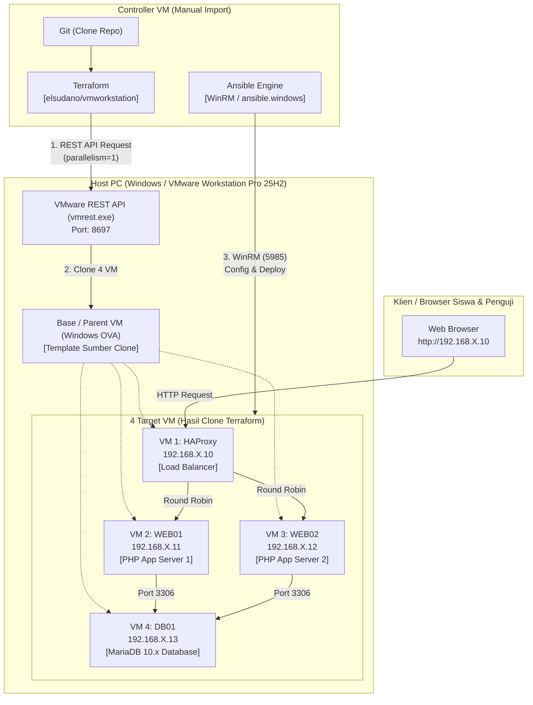

# KopDes Merah Putih &bull; Infrastructure Automation & Platform Koperasi Desa

> **MODUL PEMBELAJARAN & LIVE DEMO PRAKTIKUM DEVOPS**  
> Proyek ini adalah modul pembelajaran integratif yang menggabungkan:  
> **VMware Workstation Pro 25H2 + Terraform + Ansible + Git + HAProxy + MariaDB + Aplikasi Nyata KopDes Merah Putih**.  
> Proyek dirancang untuk kebutuhan lab sekolah/kampus: **ringan, stabil, idempotent, dan mudah dipresentasikan**.

---

## DAFTAR ISI
1. [Arsitektur Sistem & Alur Otomasi](#-arsitektur-sistem--alur-otomasi)
2. [Konsep Pembagian Tanggung Jawab](#-konsep-pembagian-tanggung-jawab)
3. [Student Configuration (Satu Sumber Kebenaran)](#-student-configuration-satu-sumber-kebenaran)
4. [Persiapan Lingkungan (VMware Workstation & vmrest)](#-persiapan-lingkungan-vmware-workstation--vmrest)
5. [Skenario Live Demo 7 Fase (Langkah demi Langkah)](#-skenario-live-demo-7-fase)
   - [Phase 1: Persiapan Manual (Import OVA)](#phase-1--preparation-manual)
   - [Phase 2: Git & Masuk ke Controller](#phase-2--git--repository-setup)
   - [Phase 3: Ubah Konfigurasi Absen Siswa](#phase-3--student-configuration)
   - [Phase 4: Provisioning Terraform](#phase-4--terraform-provisioning)
   - [Phase 5: Konfigurasi & Deployment Ansible](#phase-5--ansible-configuration--deployment)
   - [Phase 6: Verifikasi Aplikasi & Round Robin](#phase-6--live-application--round-robin)
   - [Phase 7: Simulasi Kegagalan (Failure Test)](#phase-7--high-availability-failure-test)
6. [Catatan Teknis Provider VMware & Keterbatasannya](#-catatan-teknis-provider-vmware--keterbatasannya)
7. [Target OS Windows, WinRM & Layanan NSSM](#-target-os-windows-winrm--layanan-nssm)
8. [Akun Demo & Role Aplikasi KopDes](#-akun-demo--role-aplikasi-kopdes)
9. [Struktur Direktori Lengkap](#-struktur-direktori-lengkap)

---

## 🏗 Arsitektur Sistem & Alur Otomasi

Berikut adalah diagram alur otomasi end-to-end dari Controller hingga 4 VM target yang berjalan di atas VMware Workstation:



---

## 🎯 Konsep Pembagian Tanggung Jawab

| Komponen | Tanggung Jawab Utama | Hal yang **TIDAK** Boleh Dilakukan |
| :--- | :--- | :--- |
| **Controller VM** | Menjalankan Git, Terraform, dan Ansible playbook. | Tidak menjalankan HAProxy, Web Server, atau Database. |
| **Base VM** | Template induk (parent/gold image) untuk di-clone. | Tidak menjalankan beban kerja aplikasi. Dimatikan setelah clone selesai. |
| **Terraform** | Hanya fokus pada *lifecycle infrastructure* (clone VM, nama, CPU, RAM, disk path, state VM). | Tidak menginstall software, tidak konfigurasi database, tidak deploy aplikasi. |
| **Ansible** | *Configuration management*, software runtime, setup Windows Service via NSSM, deployment kode KopDes, konfigurasi MariaDB, dan injection `.env`. | Tidak bertanggung jawab atas pembuatan/cloning VM. |
| **Web KopDes** | Aplikasi web utuh dan fungsional (Source of Truth). | Tidak diubah/di-redesign. Automation menyesuaikan ke aplikasi. |

---

## ✏️ Student Configuration (Satu Sumber Kebenaran)

Setiap siswa memiliki subnet terisolasi berdasarkan **Nomor Absen (`X`)**:
* **Subnet Siswa**: `192.168.X.0/24`
* **HAProxy (VIP)**: `192.168.X.10`
* **WEB-01**: `192.168.X.11`
* **WEB-02**: `192.168.X.12`
* **DB-01**: `192.168.X.13`

> [!IMPORTANT]
> **SISWA HANYA PERLU MENGUBAH DI 2 TEMPAT TERPUSAT:**
> 1. `terraform/terraform.tfvars` &rarr; Ganti `student_id = 17` dengan nomor absen Anda.
> 2. `ansible/inventory.ini` &rarr; Ganti angka `17` pada IP dengan nomor absen Anda.

---

## ⚙️ Persiapan Lingkungan (VMware Workstation & vmrest)

### 1. Menjalankan VMware REST API (`vmrest.exe`) di Host Windows
Provider Terraform berkomunikasi dengan VMware Workstation melalui service `vmrest`.
Buka **PowerShell / CMD as Administrator** di PC Host:

```powershell
# 1. Masuk ke direktori instalasi VMware Workstation
cd "C:\Program Files (x86)\VMware\VMware Workstation"

# 2. Atur kredensial API (hanya perlu sekali)
.\vmrest.exe -C
# Masukkan Username: admin
# Masukkan Password: PasswordKopdes2025!

# 3. Jalankan service vmrest pada port 8697
.\vmrest.exe -p 8697
```
> [!NOTE]
> Biarkan jendela terminal `vmrest.exe` tetap terbuka selama proses Terraform berjalan.

### 2. Dapatkan ID Base VM
Jalankan perintah berikut di Controller VM untuk mengetahui ID Base VM yang terbaca oleh vmrest:
```bash
curl -u admin:PasswordKopdes2025! http://192.168.X.1:8697/api/vms
```
Catat ID VM tersebut, lalu masukkan ke variabel `base_vm_id` pada `terraform/terraform.tfvars`.

### 3. Konfigurasi WinRM pada Base VM (Sekali Saja)
Sebelum Base VM dimatikan untuk dijadikan template clone, jalankan perintah standar di PowerShell (Administrator) Base VM untuk memastikan WinRM dan firewall siap:
```powershell
winrm quickconfig -q -force
winrm set winrm/config/service/auth '@{Basic="true"}'
winrm set winrm/config/service '@{AllowUnencrypted="true"}'
Set-ExecutionPolicy -ExecutionPolicy RemoteSigned -Scope LocalMachine -Force
```
Setelah selesai, **Shutdown Base VM**.

---

## 🚀 Skenario Live Demo 7 Fase

Workflow pengujian langsung di hadapan guru / penguji:

### Phase 1 — Preparation (Manual)
1. Import **Controller OVA** ke VMware Workstation.
2. Import **Base Windows VM OVA** ke VMware Workstation.
3. Pastikan `vmrest.exe` aktif di Host.
4. Pastikan WinRM aktif di Base VM, lalu matikan Base VM.

### Phase 2 — Git & Repository Setup
Masuk ke Controller VM melalui terminal/SSH:
```bash
# Kloning repository yang telah di-fork
git clone https://github.com/<username-siswa>/kopdes.git
cd kopdes
```

### Phase 3 — Student Configuration
Buka dan sesuaikan nomor absen pada file konfigurasi:
```bash
# 1. Edit Terraform variables
nano terraform/terraform.tfvars
# Pastikan: student_id = <nomor_absen_anda>

# 2. Edit Ansible inventory
nano ansible/inventory.ini
# Pastikan IP target menggunakan nomor absen Anda (contoh: 192.168.17.x)
```

### Phase 4 — Terraform Provisioning
Lakukan provisioning 4 VM target secara berurutan:
```bash
cd terraform

# Inisialisasi provider
terraform init

# Validasi sintaks
terraform validate

# Review rencana eksekusi
terraform plan

# Eksekusi pembuatan 4 VM (Wajib parallelism=1)
terraform apply -parallelism=1 -auto-approve
```
*Hasil:* 4 VM (`KopDes-X-HAProxy`, `KopDes-X-Web01`, `KopDes-X-Web02`, `KopDes-X-DB01`) berhasil di-clone dan didaftarkan pada VMware Workstation.

### Phase 5 — Ansible Configuration & Deployment
Pindah ke direktori Ansible dan jalankan konfigurasi otomatis:
```bash
cd ../ansible

# 1. Uji konektivitas WinRM ke seluruh VM Windows target
ansible windows -m win_ping

# 2. Jalankan master playbook (Idempotent)
ansible-playbook site.yml
```
*Yang dikerjakan Ansible:*
1. Mengonfigurasi firewall dan direktori kerja di semua VM.
2. Memasang MariaDB 10.x di DB01, membuat database `kopdes`, membuat user terbatas, dan mengimpor skema + data seed secara idempotent.
3. Memasang runtime PHP di Web01 dan Web02, mendeploy source code KopDes, menginjeksi `.env` dinamis (`SERVER_NODE=WEB-01` dan `WEB-02`), dan menjalankan web service via NSSM.
4. Memasang HAProxy di VM 1, mengonfigurasi `haproxy.cfg` (Round Robin + Health Check), dan menjalankan service via NSSM.
5. Menjalankan verifikasi smoke test.

### Phase 6 — Live Application & Round Robin
Buka browser di PC penguji / laptop:
```text
http://192.168.X.10/
```
1. Website KopDes Merah Putih tampil dengan antarmuka modern.
2. Perhatikan indikator **Server Node** di pojok kanan atas topbar:
   - Request 1 &rarr; Dilayani oleh `WEB-01`
   - Tekan **Refresh (F5)** &rarr; Dilayani oleh `WEB-02`
   - Tekan **Refresh (F5)** &rarr; Dilayani kembali oleh `WEB-01`
3. Buka juga dashboard statistik HAProxy untuk demonstrasi visual:
   ```text
   http://192.168.X.10:8404/
   ```
   Kedua backend `web01` dan `web02` berstatus **HIJAU (UP)**.

Uji rotasi Round Robin dari terminal Controller menggunakan curl:
```bash
for i in {1..4}; do curl -s "http://192.168.X.10/index.php?page=login" | grep -o 'WEB-0[12]'; sleep 1; done
```

### Phase 7 — High Availability Failure Test
Tunjukkan kepada penguji keandalan sistem saat terjadi insiden server:

1. **Simulasikan Kegagalan Web Server 01**:
   Hentikan service web pada `WEB-01` langsung dari Controller:
   ```bash
   ansible web01-node -m win_service -a "name=KopDesWeb state=stopped"
   ```
2. **Cek Dashboard HAProxy (`http://192.168.X.10:8404/`)**:
   Dalam hitungan detik, node `web01` otomatis ditandai **MERAH (DOWN)** oleh health check.
3. **Akses Website KopDes Kembali**:
   Refresh halaman `http://192.168.X.10/`. Website **tetap berjalan 100% normal tanpa error**, karena seluruh request dialihkan secara instan ke `WEB-02`.
4. **Pemulihan Layanan (Self-Healing / Recovery)**:
   Nyalakan kembali `WEB-01`:
   ```bash
   ansible web01-node -m win_service -a "name=KopDesWeb state=started"
   ```
   HAProxy mendeteksi node sehat kembali dan otomatis memasukkannya kembali ke rotasi Round Robin.

---

## ⚠️ Catatan Teknis Provider VMware & Keterbatasannya

1. **Mengapa Wajib `terraform apply -parallelism=1`?**  
   VMware Workstation REST API (`vmrest`) bekerja secara serial pada disk I/O lokal. Jika Terraform mencoba meng-clone 4 VM secara paralel, `vmrest` akan mengalami *disk lock contention* yang menyebabkan API crash atau timeout. Flag `-parallelism=1` menjamin proses clone dilakukan satu per satu secara aman dan stabil.
2. **Versi Provider `elsudano/vmworkstation`**:  
   Gunakan versi `~> 1.0.4`. Versi `2.0.1` memiliki bug *Go runtime panic (index out of range)* pada sistem operasi host Windows tertentu saat memproses pembuatan VM.
3. **Keberadaan VMware Tools**:  
   Base VM harus memiliki VMware Tools terpasang agar status IP dan heartbeat VM dapat dideteksi secara akurat oleh host.

---

## 🪟 Target OS Windows, WinRM & Layanan NSSM

* **WinRM Over HTTP (Port 5985)**: Digunakan sebagai media komunikasi Ansible ke Windows tanpa memerlukan SSH daemon tambahan.
* **NSSM (Non-Sucking Service Manager)**:  
   Binary portabel seperti `php.exe` (built-in server) dan `haproxy.exe` bukan merupakan *native Windows Service*. Menggunakan `sc.exe` akan menimbulkan `Error 1053`. Oleh karena itu, Ansible menggunakan `nssm.exe` untuk membungkus kedua proses tersebut menjadi Windows Service sejati yang memiliki fitur *auto-restart on failure* dan *start on boot*.
* **Idempotensi Ansible Playbook**:  
   - Pemeriksaan `win_service_info` mencegah instalasi ulang paket yang sudah ada.
   - Skrip inisialisasi MariaDB memeriksa keberadaan tabel `kopdes` sebelum mengeksekusi `schema.sql` dan `seed.sql`, sehingga `ansible-playbook` dapat dijalankan berulang kali dengan status `OK`.

---

## 👥 Akun Demo & Role Aplikasi KopDes

Semua akun demo di-seed dengan password default: **`password123`**

| Role | Email Demo | Wewenang & Fitur |
| :--- | :--- | :--- |
| **HEAD_GOV** | `head@gov.local` | Master overview, **+ Spawn KopDes**, manajemen seluruh unit desa, pendaftaran manager, rekapitulasi omzet, monitoring kluster node. |
| **MANAGER** | `manager@gov.local` | Pengelola unit usaha: Tambah/edit produk etalase, daftarkan anggota warga desa, kelola kasir transaksi penjualan. |
| **CITIZEN** | `citizen@gov.local` | Warga desa: Menjelajah katalog KopDes, mendaftar keanggotaan, memesan komoditas desa, nota transaksi pribadi. |

---

## 📂 Struktur Direktori Lengkap

```text
kopdes/
├── terraform/                         # Infrastructure Layer (Provisioning)
│   ├── versions.tf                    # Provider elsudano/vmworkstation v1.0.4
│   ├── variables.tf                   # Variabel student_id (X), vmrest, dan VM specs
│   ├── terraform.tfvars               # Tempat siswa mengganti nomor absen
│   ├── main.tf                        # Resource clone 4 target VM (HAProxy, Web01, Web02, DB01)
│   └── outputs.tf                     # Informasi alokasi IP statis & instruksi Ansible
│
├── ansible/                           # Configuration & Deployment Layer
│   ├── ansible.cfg                    # Konfigurasi WinRM, timeout, dan display
│   ├── inventory.ini                  # Inventory target VM Windows per absen siswa
│   ├── group_vars/
│   │   └── all.yml                    # Konfigurasi terpusat (IP, database, direktori)
│   ├── site.yml                       # Master playbook 5 plays
│   ├── roles/
│   │   ├── common/                    # Baseline Windows, direktori, firewall ICMP
│   │   ├── database/                  # Setup MariaDB 10.x, hak akses, import schema/seed
│   │   │   ├── tasks/main.yml
│   │   │   └── templates/init_db.sql.j2
│   │   ├── webserver/                 # Setup PHP, NSSM service, deploy KopDes, inject .env
│   │   │   ├── tasks/main.yml
│   │   │   ├── handlers/main.yml
│   │   │   └── templates/
│   │   │       ├── env.j2
│   │   │       └── php.ini.j2
│   │   └── haproxy/                   # Setup HAProxy, Round Robin, Health Check, Stats Page
│   │       ├── tasks/main.yml
│   │       ├── handlers/main.yml
│   │       └── templates/haproxy.cfg.j2
│
├── config/                            # Existing KopDes Configuration (Source of Truth)
├── database/                          # Existing KopDes SQL Schema & Seed
├── includes/                          # Existing KopDes PHP Helpers & Core Components
├── pages/                             # Existing KopDes Pages (HeadGov, Manager, Citizen)
├── public/                            # Existing KopDes Web Root & Assets
├── tests/                             # E2E Test Suite
├── .env.example                       # Contoh environment
└── README.md                          # Panduan lengkap pembelajaran DevOps

