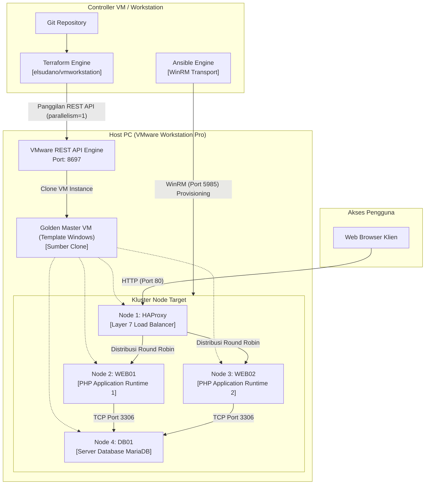

# KopDes Merah Putih: Otomasi Infrastruktur dan Platform Koperasi Desa

Implementasi Infrastructure as Code (IaC) dan manajemen konfigurasi multi-tier untuk Platform Koperasi Desa KopDes Merah Putih, diotomatisasi menggunakan Terraform, Ansible, dan VMware Workstation.

---

## Daftar Isi

- [Ringkasan Proyek](#ringkasan-proyek)
- [Arsitektur Sistem](#arsitektur-sistem)
- [Topologi Infrastruktur](#topologi-infrastruktur)
- [Pemisahan Tanggung Jawab](#pemisahan-tanggung-jawab)
- [Teknologi yang Digunakan](#teknologi-yang-digunakan)
- [Manajemen Layanan dan Runtime](#manajemen-layanan-dan-runtime)
- [Role Pengguna dan Hak Akses](#role-pengguna-dan-hak-akses)
- [Struktur Direktori Repository](#struktur-direktori-repository)
- [Panduan Deployment](#panduan-deployment)
- [Lisensi dan Catatan](#lisensi-dan-catatan)

---

## Ringkasan Proyek

KopDes Merah Putih adalah platform digital yang dirancang untuk mengelola unit usaha koperasi desa, rantai pasok komoditas lokal, registrasi keanggotaan warga, serta pencatatan transaksi kasir Point of Sale (POS).

Repository ini menyediakan lapisan otomasi infrastruktur lengkap untuk melakukan provisioning, konfigurasi, dan orkestrasi platform pada cluster multi-node dengan ketersediaan tinggi (High Availability). Otomasi memanfaatkan HashiCorp Terraform untuk mengelola siklus hidup cloning Virtual Machine melalui VMware Workstation REST API, serta Ansible untuk menjalankan manajemen konfigurasi yang idempotent, penyediaan runtime, dan deployment kode aplikasi melalui protokol WinRM.

---

## Arsitektur Sistem

Arsitektur sistem menerapkan kluster produksi empat node yang berada di belakang load balancer Layer 7. Load balancer mendistribusikan beban lalu lintas secara merata ke dua server aplikasi PHP yang terhubung ke server database MariaDB terpusat.



---

## Topologi Infrastruktur

Kluster terdiri dari empat Virtual Machine yang terhubung dalam satu segmen jaringan virtual host-only atau NAT yang terisolasi.

| Hostname | Peran (Role) | Sistem Operasi | IP Default | Layanan yang Dijalankan |
| :--- | :--- | :--- | :--- | :--- |
| `KopDes-HAProxy` | Load Balancer | Windows 64-bit | `192.168.X.10` | HAProxy (Port 80), Dashboard Statistik (Port 8404) |
| `KopDes-Web01` | Server Aplikasi 1 | Windows 64-bit | `192.168.X.11` | PHP Built-in Server (Port 8080) di-wrap oleh NSSM |
| `KopDes-Web02` | Server Aplikasi 2 | Windows 64-bit | `192.168.X.12` | PHP Built-in Server (Port 8080) di-wrap oleh NSSM |
| `KopDes-DB01` | Database Server | Windows 64-bit | `192.168.X.13` | MariaDB 10.11 Enterprise LTS (Port 3306) |

*Catatan: Oktet subnet `X` dapat disesuaikan secara terpusat melalui variabel konfigurasi untuk mendukung segmentasi lab atau multi-environment.*

---

## Pemisahan Tanggung Jawab

Setiap komponen dalam repository memiliki batasan fungsi yang jelas:

| Lapisan | Tanggung Jawab Utama | Batasan |
| :--- | :--- | :--- |
| **Terraform** | Mengelola siklus hidup Virtual Machine: cloning dari template base, alokasi vCPU, memori RAM, konfigurasi adapter jaringan, dan pembuatan disk virtual. | Tidak menginstal software aplikasi, tidak mengonfigurasi database, dan tidak menginjeksi environment runtime. |
| **Ansible** | Orkestrasi pasca-booting: standardisasi firewall Windows, penyediaan dependency, instalasi database, registrasi Windows Service via NSSM, dan injeksi konfigurasi `.env`. | Tidak bertanggung jawab atas pembuatan atau penghapusan VM pada level hypervisor. |
| **Aplikasi Web** | Menjalankan logika bisnis platform koperasi: autentikasi, manajemen katalog, transaksi kasir, dan penentuan koordinat lokasi unit usaha. | Source code aplikasi terisolasi dari perkakas deployment dan hypervisor. |
| **Base Virtual Machine** | Template gold image yang memuat OS Windows, VMware Tools aktif, dan konfigurasi WinRM listener siap pakai. | Hanya berfungsi sebagai sumber cloning (read-only) dan tidak melayani traffic aplikasi secara langsung. |

---

## Teknologi yang Digunakan

### Infrastruktur dan Otomasi
- **Hypervisor**: VMware Workstation Pro 25H2
- **Antarmuka Hypervisor**: VMware REST API (`vmrest.exe`)
- **Infrastructure as Code**: Terraform v1.5+ dengan provider `elsudano/vmworkstation` v1.0.4
- **Configuration Management**: Ansible Core 2.15+ dengan koleksi `ansible.windows`
- **Protokol Transport**: Windows Remote Management (WinRM HTTP Port 5985)

### Platform dan Runtime Aplikasi
- **Load Balancer**: HAProxy 2.8+ untuk Windows (Layer 7 Round Robin, Health Checks aktif)
- **Runtime Aplikasi**: PHP 8.2+ 64-bit Non-Thread Safe
- **Manajer Layanan**: Non-Sucking Service Manager (NSSM)
- **Database Engine**: MariaDB 10.11 Enterprise LTS
- **Frontend Aplikasi**: Plain HTML5, Modern Vanilla CSS3, JavaScript Modular, Leaflet.js

---

## Manajemen Layanan dan Runtime

### Penggunaan NSSM pada Windows
Utilitas portabel pada Windows (seperti binary CLI `php.exe` dan `haproxy.exe`) tidak memiliki fungsi integrasi bawaan dengan Windows Service Control Manager (`sc.exe`). Penggunaan perintah `sc.exe` secara langsung akan memicu kegagalan `Error 1053`.

Untuk menjaga reliabilitas sistem, Ansible menggunakan **Non-Sucking Service Manager (`nssm.exe`)** sebagai pembungkus proses menjadi Windows Service sejati:
- `KopDesWeb`: Membungkus proses web server PHP pada Web01 dan Web02 dengan kemampuan restart otomatis saat terjadi crash serta berjalan di background service.
- `HAProxy`: Membungkus proses load balancer HAProxy dengan pencatatan log mandiri dan kemampuan reload konfigurasi secara graceful.

### Idempotensi Playbook Ansible
- **Penyediaan Database**: Role MariaDB melakukan verifikasi terhadap keberadaan skema database sebelum menjalankan migrasi SQL, mencegah data tertimpa pada eksekusi ulang playbook.
- **Pengecekan Layanan**: Task Ansible memanfaatkan modul `win_service_info` dan pengecekan path direktori untuk memastikan paket binary hanya diunduh saat belum terpasang.

---

## Role Pengguna dan Hak Akses

Platform KopDes menyediakan sistem kontrol akses berbasis peran (RBAC) dengan kredensial default sebagai berikut:

| Identifier Role | Username Default | Password Default | Lingkup Otoritas |
| :--- | :--- | :--- | :--- |
| `HEAD_GOV` | `head@gov.local` | `password123` | Administrator wilayah: membuat unit koperasi baru (+ Spawn KopDes), audit omzet kumulatif, pendaftaran manager, dan pemantauan kluster. |
| `MANAGER` | `manager@gov.local` | `password123` | Pengelola unit usaha: manajemen etalase komoditas, registrasi anggota warga desa, dan pencatatan transaksi kasir. |
| `CITIZEN` | `citizen@gov.local` | `password123` | Warga desa: akses katalog komoditas koperasi, pengajuan keanggotaan, pemesanan produk desa, dan melihat nota transaksi. |

---

## Struktur Direktori Repository

```text
kopdes/
|-- terraform/                         # Infrastructure as Code (Provisioning VM)
|   |-- versions.tf                    # Deklarasi provider elsudano/vmworkstation
|   |-- variables.tf                   # Definisi variabel (Subnet ID, Host, VM IDs)
|   |-- terraform.tfvars               # Nilai variabel deployment lingkungan
|   |-- main.tf                        # Deklarasi resource untuk 4 VM target
|   `-- outputs.tf                     # Output alokasi IP dan topologi kluster
|
|-- ansible/                           # Manajemen Konfigurasi dan Deployment
|   |-- ansible.cfg                    # Konfigurasi WinRM, timeout, dan transport
|   |-- inventory.ini                  # Definisi inventory host target
|   |-- group_vars/
|   |   `-- all.yml                    # Variabel global, path direktori, kredensial
|   |-- site.yml                       # Master playbook multi-play
|   `-- roles/
|       |-- common/                    # Baseline aturan firewall dan direktori kerja
|       |-- database/                  # Instalasi MariaDB 10.x, hak akses, import data
|       |-- webserver/                 # Runtime PHP, service NSSM, deploy kode, .env dinamis
|       `-- haproxy/                   # Binary HAProxy, routing Round Robin, health check
|
|-- config/                            # Konfigurasi database dan environment aplikasi
|-- database/                          # Skema SQL produksi dan data seed awal
|-- includes/                          # Library dan komponen aplikasi PHP
|-- pages/                             # Tampilan halaman berbasis role dan endpoint API
|-- public/                            # Dokumen root web publik, styling CSS, dan aset
|-- tests/                             # Pengujian end-to-end dan integrasi otomatis
|-- .env.example                       # Template konfigurasi environment
|-- TUTORIAL.md                        # Panduan deployment lengkap langkah-demi-langkah
`-- README.md                          # Dokumentasi teknis dan arsitektur proyek
```

---

## Panduan Deployment

Panduan lengkap instalasi dan deployment dari awal (mulai dari persiapan template OVA, aktivasi VMware REST API, provisioning Terraform, hingga deployment Ansible) tersedia pada dokumen tersendiri:

**[Panduan Lengkap Deployment dari Awal (TUTORIAL.md)](TUTORIAL.md)**

---

## Lisensi dan Catatan

Proyek ini merupakan model implementasi otomasi infrastruktur DevOps untuk tujuan simulasi dan pembelajaran teknis. Seluruh nama desa, data unit koperasi, dan riwayat transaksi pada seed awal merupakan data dummy untuk pengujian sistem.
