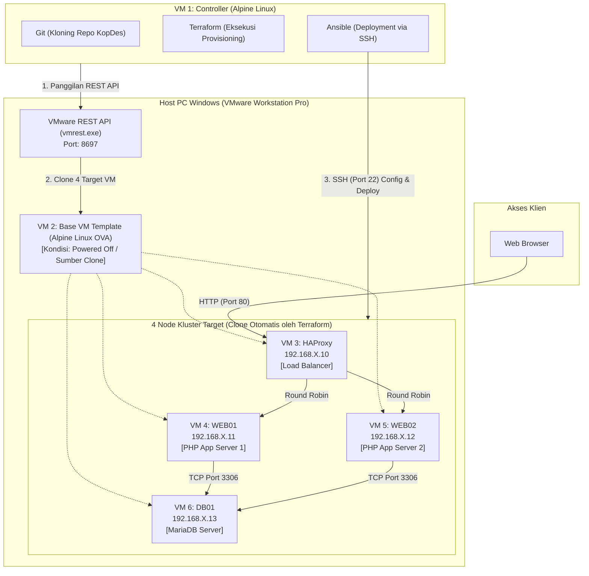

# Panduan Deployment End-to-End: Otomasi Infrastruktur KopDes (Kluster 6 VM Alpine Linux)

Panduan ini menyajikan langkah-demi-langkah yang komprehensif untuk mendeploy kluster ketersediaan tinggi (High Availability) KopDes Merah Putih dari awal (nol) pada VMware Workstation Pro. 

Seluruh sistem dirancang menggunakan total **6 Virtual Machine berbasis Alpine Linux** (`Alpine-virt-3.24.1-x86_64, ~142 MB`) yang berasal dari satu file template OVA yang sama, sehingga sangat ringan, cepat, dan tidak lagi bergantung pada Windows ataupun distro lain seperti Ubuntu/Debian untuk menjalankan skrip otomasi.

---

## Daftar Isi

1. [Konsep Arsitektur 6 VM Alpine Linux](#1-konsep-arsitektur-6-vm-alpine-linux)
2. [Prasyarat dan Kebutuhan Sistem](#2-prasyarat-dan-kebutuhan-sistem)
3. [Tahap 1: Setup VM Controller (Alpine Linux)](#3-tahap-1-setup-vm-controller-alpine-linux)
4. [Tahap 2: Setup Base VM Template (Alpine Linux)](#4-tahap-2-setup-base-vm-template-alpine-linux)
5. [Tahap 3: Menjalankan VMware REST API pada Host Windows](#5-tahap-3-menjalankan-vmware-rest-api-pada-host-windows)
6. [Tahap 4: Penyesuaian Variabel pada Controller VM](#6-tahap-4-penyesuaian-variabel-pada-controller-vm)
7. [Tahap 5: Provisioning 4 VM Target Menggunakan Terraform](#7-tahap-5-provisioning-4-vm-target-menggunakan-terraform)
8. [Tahap 6: Manajemen Konfigurasi dan Deployment dengan Ansible](#8-tahap-6-manajemen-konfigurasi-dan-deployment-dengan-ansible)
9. [Tahap 7: Verifikasi dan Pengujian Kluster](#9-tahap-7-verifikasi-dan-pengujian-kluster)
10. [Tahap 8: Simulasi Kegagalan dan Pengujian Failover](#10-tahap-8-simulasi-kegagalan-dan-pengujian-failover)
11. [Tahap 9: Penghapusan dan Pembersihan Infrastruktur](#11-tahap-9-penghapusan-dan-pembersihan-infrastruktur)
12. [Panduan Pemecahan Masalah (Troubleshooting)](#12-panduan-pemecahan-masalah-troubleshooting)

---

## 1. Konsep Arsitektur 6 VM Alpine Linux

Sistem terdiri dari total **6 Virtual Machine** di VMware Workstation yang semuanya berbasis **Alpine Linux**:



Rincian 6 Virtual Machine dalam sistem:
1. **VM 1 (`KopDes-Controller`)**: Workstation otomasi siswa tempat `git clone` repository KopDes, menjalankan Terraform, dan mengeksekusi Ansible.
2. **VM 2 (`Alpine-Base-VM`)**: Master golden image template (dibuat dari OVA, disiapkan SSH-nya, lalu dimatikan / *powered off* sebagai sumber clone murni Terraform).
3. **VM 3 (`KopDes-HAProxy`)**: Node Load Balancer Layer 7 (IP: `192.168.X.10`) hasil clone Terraform.
4. **VM 4 (`KopDes-Web01`)**: Node Web Application Server 1 (IP: `192.168.X.11`) hasil clone Terraform.
5. **VM 5 (`KopDes-Web02`)**: Node Web Application Server 2 (IP: `192.168.X.12`) hasil clone Terraform.
6. **VM 6 (`KopDes-DB01`)**: Node Database Server MariaDB (IP: `192.168.X.13`) hasil clone Terraform.

---

## 2. Prasyarat dan Kebutuhan Sistem

### Spesifikasi Host PC
- **Sistem Operasi**: Windows 10 atau Windows 11 (64-bit)
- **Perangkat Lunak Virtualisasi**: VMware Workstation Pro 25H2 (atau versi 17+)
- **Prosesor**: Minimal 2 Core Fisik (4 Thread), VT-x / AMD-V aktif pada BIOS/UEFI
- **Memori RAM**: Minimal 8 GB (seluruh 6 VM Alpine Linux hanya membutuhkan total ~3 GB RAM)
- **Ruang Penyimpanan**: Minimal 10 GB ruang kosong (media SSD / HDD)
- **File Template Base**: `D:\Virtual Machines\ISO\Alpine-virt-3.24.1-x86_64-v1_root-root_alpine-alpine.ova` (~142 MB)

---

## 3. Tahap 1: Setup VM Controller (Alpine Linux)

VM Controller dibuat langsung dari OVA Alpine Linux. Di VM inilah seluruh skrip Git, Terraform, dan Ansible dijalankan.

### 3.1 Import OVA Menjadi VM Controller
1. Buka **VMware Workstation Pro**.
2. Pilih menu **File > Open**, pilih file OVA:
   `D:\Virtual Machines\ISO\Alpine-virt-3.24.1-x86_64-v1_root-root_alpine-alpine.ova`
3. Beri nama VM: `KopDes-Controller`.
4. Tentukan folder penyimpanan (misalnya `D:\Virtual Machines\KopDes-Controller`).
5. Arahkan Network Adapter ke jaringan yang sama dengan Host (Host-Only `VMnet1` atau NAT `VMnet8`).

### 3.2 Nyalakan VM Controller dan Pasang Perkakas Otomasi
1. Nyalakan `KopDes-Controller`.
2. Login di konsol dengan kredensial default:
   - **Username**: `root`
   - **Password**: `root` (atau `alpine`)
3. Aktifkan repositori `community` pada Alpine Linux agar paket Terraform dan Ansible tersedia:
   ```sh
   sed -i 's/^#\(.*\/community\)/\1/' /etc/apk/repositories
   ```
4. Pasang seluruh perkakas otomasi menggunakan manajer paket `apk`:
   ```sh
   apk update
   apk add git curl jq openssh terraform ansible python3 nano
   ```
5. Clone repository proyek KopDes langsung ke VM Controller:
   ```sh
   git clone https://github.com/fendyramadhani9-cloud/kopdes-iac-automation.git kopdes
   cd kopdes
   ```

---

## 4. Tahap 2: Setup Base VM Template (Alpine Linux)

Base VM berfungsi sebagai template emas (*golden image*) yang akan digandakan menjadi 4 target VM oleh Terraform.

### 4.1 Import OVA Menjadi Base VM Template
1. Di VMware Workstation Pro, pilih **File > Open** kembali file OVA yang sama.
2. Beri nama VM: `Alpine-Base-VM`.
3. Tentukan folder penyimpanan (misalnya `D:\Virtual Machines\Alpine-Base-VM`).
4. Atur Network Adapter ke jaringan yang sama (Host-Only `VMnet1` atau NAT `VMnet8`).

### 4.2 Siapkan SSH dan Matikan Base VM
1. Nyalakan `Alpine-Base-VM`.
2. Login dengan akun `root` / `root`.
3. Pastikan service OpenSSH aktif saat booting:
   ```sh
   rc-update add sshd default
   rc-service sshd start
   ```
4. Izinkan login SSH menggunakan user `root`:
   ```sh
   sed -i 's/^#PermitRootLogin.*/PermitRootLogin yes/' /etc/ssh/sshd_config
   sed -i 's/^PermitRootLogin.*/PermitRootLogin yes/' /etc/ssh/sshd_config
   rc-service sshd restart
   ```
5. Pastikan paket Python 3 terpasang (diperlukan saat Ansible melakukan deployment):
   ```sh
   apk update
   apk add python3 curl openrc
   ```
6. **Matikan Base VM secara bersih**:
   ```sh
   poweroff
   ```

> **PENTING**: Base VM **wajib dalam kondisi mati (powered off)** agar REST API VMware dapat mengkloningnya.

---

## 5. Tahap 3: Menjalankan VMware REST API pada Host Windows

Terraform di dalam VM Controller akan memerintahkan VMware Workstation di Host Windows untuk meng-clone VM melalui service `vmrest.exe`.

### 5.1 Konfigurasi Kredensial API di Host PC
Buka **PowerShell sebagai Administrator** pada Host Windows Anda:

```powershell
# 1. Pindah ke direktori VMware Workstation
cd "C:\Program Files (x86)\VMware\VMware Workstation"

# 2. Atur username dan password REST API (cukup sekali saja)
.\vmrest.exe -C
```
- Username: `admin`
- Password: `PasswordKopdes2025!`

### 5.2 Jalankan Service REST API di Host PC
```powershell
.\vmrest.exe -p 8697
```
*Biarkan terminal PowerShell ini tetap terbuka.*

### 5.3 Cek ID Base VM dari Controller VM
Kembali ke terminal **VM Controller (Alpine Linux)**, jalankan:

```sh
curl -u admin:PasswordKopdes2025! http://<IP_HOST_WINDOWS>:8697/api/vms
```
*(Ganti `<IP_HOST_WINDOWS>` dengan IP adapter VMware Host Anda, misalnya `192.168.17.1`).*

Output JSON akan menampilkan daftar VM:
```json
[
  {
    "id": "A1B2C3D4-E5F6-7890-ABCD-EF1234567890",
    "path": "D:\\Virtual Machines\\Alpine-Base-VM\\Alpine-Base-VM.vmx"
  }
]
```
Salin nilai `"id"` dari `Alpine-Base-VM`.

---

## 6. Tahap 4: Penyesuaian Variabel pada Controller VM

Di dalam **VM Controller (Alpine Linux)** pada direktori `/root/kopdes`:

### 6.1 Sesuaikan `terraform/terraform.tfvars`
```sh
nano terraform/terraform.tfvars
```

Periksa dan sesuaikan:
```hcl
# Nomor subnet absen
student_id = 17

# Endpoint vmrest di Host Windows
vmws_url      = "http://192.168.17.1:8697/api"
vmws_user     = "admin"
vmws_password = "PasswordKopdes2025!"
vmws_https    = false

# ID Base VM Alpine yang disalin dari Tahap 3
base_vm_id    = "A1B2C3D4-E5F6-7890-ABCD-EF1234567890"

# Folder di Host Windows tempat menyimpan hasil clone
vm_target_dir = "D:\\Virtual Machines\\KopDes"

# Alokasi resource per VM
vm_processors = 1
vm_memory_mb  = 512
```

### 6.2 Sesuaikan `ansible/inventory.ini`
```sh
nano ansible/inventory.ini
```

Pastikan IP target menggunakan nomor subnet yang sama:
```ini
[haproxy]
haproxy-node ansible_host=192.168.17.10

[webservers]
web01-node ansible_host=192.168.17.11 server_node_name=WEB-01
web02-node ansible_host=192.168.17.12 server_node_name=WEB-02

[database]
db01-node ansible_host=192.168.17.13

[alpine:children]
haproxy
webservers
database

[alpine:vars]
ansible_user=root
ansible_password=root
ansible_connection=ssh
ansible_port=22
ansible_ssh_common_args='-o StrictHostKeyChecking=no -o UserKnownHostsFile=/dev/null'
ansible_python_interpreter=/usr/bin/python3
```

---

## 7. Tahap 5: Provisioning 4 VM Target Menggunakan Terraform

Jalankan perintah berikut di dalam **VM Controller**:

```sh
cd terraform

# Inisialisasi provider
terraform init

# Validasi sintaks
terraform validate

# Review rencana clone 4 VM
terraform plan

# Eksekusi cloning 4 VM (Wajib -parallelism=1)
terraform apply -parallelism=1 -auto-approve
```

> **Catatan Teknis `-parallelism=1`**:  
> Flag `-parallelism=1` memastikan VMware REST API melakukan clone disk satu per satu secara berurutan agar tidak terjadi konflik I/O disk di Host. Karena ukuran disk Alpine Linux hanya ~142 MB, proses kloning ke-4 VM selesai hanya dalam beberapa detik.

Setelah selesai, periksa VMware Workstation di Host: ke-4 VM (`KopDes-17-HAProxy`, `KopDes-17-Web01`, `KopDes-17-Web02`, `KopDes-17-DB01`) telah berhasil dibuat dan otomatis menyala.

---

## 8. Tahap 6: Manajemen Konfigurasi dan Deployment dengan Ansible

Masih di dalam **VM Controller**, jalankan konfigurasi otomatis:

```sh
cd ../ansible

# 1. Uji konektivitas SSH ke seluruh 4 VM target
ansible alpine -m ping
```
Seluruh node target harus merespons `"ping": "pong"`.

```sh
# 2. Jalankan master playbook deployment
ansible-playbook site.yml
```

Playbook akan mengeksekusi secara otomatis:
1. **Common Role**: Memastikan paket dasar dan direktori `/var/www/kopdes` tersedia di semua node.
2. **Database Role (DB01)**: Menginstal MariaDB, menginisialisasi database, mengatur `bind-address = 0.0.0.0`, dan mengimpor skema + data seed KopDes secara idempotent.
3. **Webserver Role (Web01 & Web02)**: Menginstal runtime PHP dan ekstensi, menyalin kode KopDes, menginjeksi konfigurasi `.env`, dan mengaktifkan service OpenRC `/etc/init.d/kopdes` pada port 80.
4. **HAProxy Role**: Menginstal HAProxy, menerapkan konfigurasi load balancing Round Robin ke Web01 & Web02, serta mengaktifkan dashboard statistik pada port 8404.
5. **Smoke Tests**: Memvalidasi kesiapan respon HTTP dari HAProxy.

---

## 9. Tahap 7: Verifikasi dan Pengujian Kluster

### 9.1 Akses Website KopDes
Buka browser dari Host PC Anda:
```text
http://192.168.17.10/
```
Website KopDes Merah Putih akan tampil langsung melalui load balancer HAProxy.

### 9.2 Uji Distribusi Beban Round Robin
Perhatikan label **Server Node** di topbar kanan atas:
- Tekan **Refresh (F5)**: Label akan bergantian menampilkan `WEB-01` dan `WEB-02`.
- Verifikasi juga dapat dijalankan langsung dari terminal Controller:
  ```sh
  for i in {1..4}; do
      curl -s "http://192.168.17.10/index.php?page=login" | grep -o 'WEB-0[12]'
      sleep 1
  done
  ```

### 9.3 Dashboard Pemantauan HAProxy
Buka dashboard statistik di browser:
```text
http://192.168.17.10:8404/
```
Kedua node backend (`web01` dan `web02`) berstatus **hijau (`UP`)**.

### 9.4 Pengujian Fitur Peta (Spawn KopDes)
1. Login dengan akun: `head@gov.local` / `password123`.
2. Klik tombol **+ Spawn KopDes**.
3. Klik titik koordinat pada peta interaktif Leaflet.
4. Simpan unit usaha. Data koordinat lintang dan bujur akan tersimpan ke MariaDB di node DB01.

---

## 10. Tahap 8: Simulasi Kegagalan dan Pengujian Failover

1. **Hentikan Layanan di WEB-01** dari VM Controller:
   ```sh
   ansible web01-node -m command -a "rc-service kopdes stop"
   ```
2. **Cek Dashboard HAProxy** (`http://192.168.17.10:8404/`): Status `web01` otomatis berubah menjadi **merah (`DOWN`)**.
3. **Akses Website**: Refresh `http://192.168.17.10/`. Website tetap berjalan tanpa kendala karena dialihkan 100% ke `WEB-02`.
4. **Pulihkan Layanan (Self-Healing)**:
   ```sh
   ansible web01-node -m command -a "rc-service kopdes start"
   ```
   Status di HAProxy kembali hijau (`UP`) dan rotasi Round Robin aktif kembali.

---

## 11. Tahap 9: Penghapusan dan Pembersihan Infrastruktur

Jika pengujian telah selesai dan Anda ingin membersihkan ke-4 VM hasil kloning:

```sh
cd /root/kopdes/terraform
terraform destroy -parallelism=1 -auto-approve
```

---

## 12. Panduan Pemecahan Masalah (Troubleshooting)

### Kendala 1: Paket `terraform` atau `ansible` Tidak Ditemukan saat `apk add`
- **Penyebab**: Repositori `community` di `/etc/apk/repositories` belum diaktifkan.
- **Solusi**: Jalankan perintah berikut pada VM Controller:
  ```sh
  sed -i 's/^#\(.*\/community\)/\1/' /etc/apk/repositories
  apk update
  apk add terraform ansible
  ```

### Kendala 2: Koneksi SSH ke Node Target Ditolak (Permission Denied)
- **Penyebab**: Base VM belum mengizinkan `PermitRootLogin yes` di file `/etc/ssh/sshd_config`.
- **Solusi**: Pastikan pada Base VM baris `PermitRootLogin yes` aktif, lalu restart sshd: `rc-service sshd restart`.

### Kendala 3: Terraform Error 401 Unauthorized
- **Penyebab**: Kredensial `vmws_user` atau `vmws_password` pada `terraform.tfvars` tidak cocok dengan kredensial yang dibuat pada `vmrest.exe -C` di Host Windows.
- **Solusi**: Atur ulang kredensial di Host Windows dengan menjalankan `.\vmrest.exe -C`.
